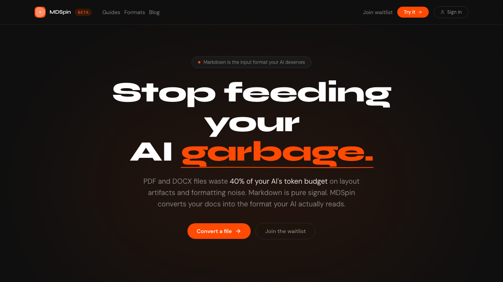

# MDSpin

> Convert PDFs, DOCX, PPTX, and more to clean, AI-ready Markdown.

[](https://mdspin.app) [](LICENSE) [](https://nextjs.org)



**[Try it at mdspin.app →](https://mdspin.app)**

MDSpin converts documents into clean Markdown optimised for LLMs, RAG pipelines, and AI workflows. Drop a file, get AI-ready text in seconds — no setup, no CLI, no Python.

## Features

- PDF, DOCX, PPTX, XLSX, HTML, TXT, RTF support
- Token reduction metrics after each conversion
- No signup required to try
- Conversion history for logged-in users
- Works with ChatGPT, Claude, Gemini, and any LLM

## Tech Stack

Next.js 15 · TypeScript · Tailwind CSS · Supabase · Vercel

## Local Development

```bash
git clone https://github.com/trenknerpeter/mdspin.git
cd mdspin
npm install
cp .env.example .env.local   # fill in your values — see Environment Variables below
npm run dev
```

## Environment Variables

| Variable | Description |
|---|---|
| `BACKEND_URL` | URL of the conversion API |
| `BACKEND_API_KEY` | API key for the conversion backend |
| `NEXT_PUBLIC_SUPABASE_URL` | Supabase project URL |
| `NEXT_PUBLIC_SUPABASE_ANON_KEY` | Supabase anon/public key |
| `SUPABASE_SERVICE_ROLE_KEY` | Supabase service role key (server-side only) |

The conversion backend is a separate private service. To use your own, implement an endpoint that accepts `multipart/form-data` with a `file` field and returns `{ markdown: string }`.

## Contributing

PRs and issues welcome. This is a side project so response times may vary, but improvements to the UI, new format support, or documentation are all appreciated.

## License

MIT © 2026 Peter Trenkner
